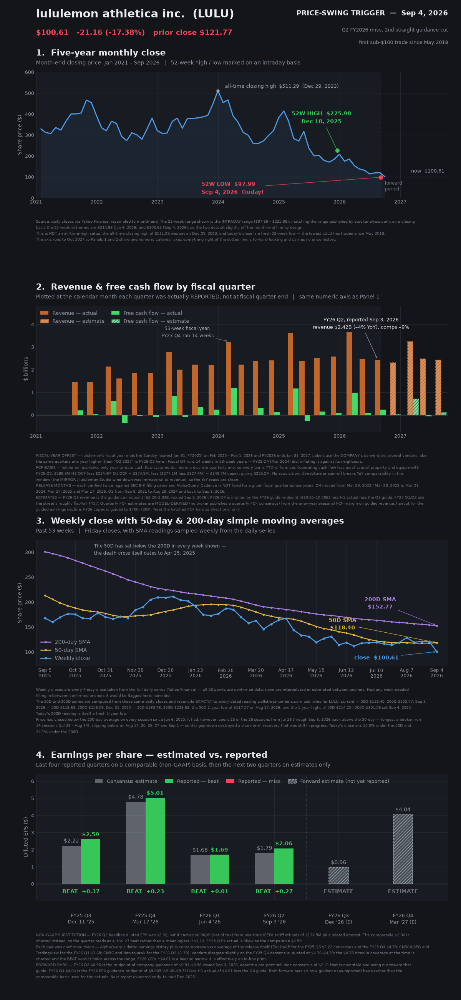

# LULU — lululemon athletica inc.

**Price-swing trigger, September 4, 2026** — daily move down **−17.38%** (close $121.77 → $100.61)

Trigger cause: Q2 fiscal 2026 results, released after the close on September 3, 2026. Revenue
of $2.416B (−4% YoY) missed the ~$2.46B consensus, comparable sales fell 9% (−10% constant
currency), and management cut full-year revenue guidance for the second consecutive quarter, to
$10.35–10.50B from $11.00–11.15B. The stock traded below $100 intraday for the first time since
May 2018.

---

## 1. Distance from the 52-week high

| Reference | Level | Date | Distance from $100.61 |
|---|---|---|---|
| 52-week high (intraday) | **$225.98** | Dec 18, 2025 | **−55.5%** |
| 52-week high (closing) | $215.88 | Jan 6, 2026 | −53.4% |
| All-time high (closing) | $511.29 | Dec 29, 2023 | −80.3% |
| 52-week low (intraday) | $97.99 | **Sep 4, 2026 — today** | +2.7% above |

This is **not** an all-time-high situation: LULU peaked in December 2023 and today's print is a
fresh 52-week low that also happens to be the lowest the stock has traded since May 2018. Today's
session set the low end of its own 52-week range, so the "distance from the low" figure above is
mechanically near zero — the stock is at the bottom of its one-year range, not somewhere inside it.

---

## 2. Panel-by-panel verdicts

### Section 2 — Revenue & free cash flow: **Negative**

The panel's own bars carry the verdict. FY26 Q2 revenue of **$2.416B** is below the **$2.525B**
lululemon reported for the same fiscal quarter a year earlier — the first year-over-year revenue
decline in the 21 quarters charted, in a series that had grown every single quarter since 2021.
The four hatched forward bars extend the decline rather than arrest it: the Q3 guide of
$2.29–2.32B is −10% to −11% YoY, and the FY26 guide implies roughly $10.4B against $11.10B
delivered in FY25.

Free cash flow looks superficially better — FY26 Q2 FCF of **$225.2M** is up from $150.8M a year
prior — but the quarter absorbed a **$134.5M one-time IEEPA tariff refund plus related interest**.
Strip that and the underlying quarterly FCF is roughly flat to down. The multi-year trend is
unambiguous: full-year FCF ran **$1,583M in FY24 → $922M in FY25**, a 42% drop *before* FY26's
guidance cuts, while capex is still guided to $700–720M. Falling revenue against fixed, elevated
capex is what compresses the green bars.

### Section 3 — Technicals: **Negative**

Every readable signal on the panel points one way. Today's close of $100.61 sits **15.0% below
the 50-day SMA ($118.40)** and **34.1% below the 200-day SMA ($152.77)**. The gold line has been
under the purple line in every one of the 53 weeks charted — the death cross itself dates back to
April 25, 2025 — and price has closed below the 200-day average on *every* session since June 6,
2025. Both averages are pinned at or near their one-year lows (50D low $117.57 on Aug 17, 2026;
the 200D is printing a fresh one-year low today at $152.77), which means both are sloping down
and sitting *overhead* as resistance rather than beneath price as support.

The one constructive detail the panel contains makes the damage worse, not better: LULU had
reclaimed its 50-day average, closing above it in 23 of the 28 sessions from July 28 through
September 3 (longest unbroken run 14 sessions, July 28 – August 14; it slipped back below on
August 17, 20, 26, 27 and September 1). That recovery was real but not yet clean, and this
gap-down destroyed it outright — which is why the last blue segment on the chart is so much
steeper than anything before it.

### Section 4 — EPS estimated vs. reported: **Positive**

On its own data this panel is the one bright spot: **four beats out of four reported quarters** —
FY25 Q3 +$0.37, FY25 Q4 +$0.23, FY26 Q1 +$0.01, FY26 Q2 +$0.27 (comparable basis, excluding the
$0.86/sh tariff-refund benefit that would otherwise make the last bar meaningless). lululemon is
still converting a shrinking top line into earnings ahead of what the street models.

Two caveats that the panel shows but the one-word verdict cannot: the *level* the company is
beating is collapsing — the FY26 Q3 estimate bar of $0.96 is 63% below the $2.59 it reported a
year ago, and sits against a pre-print consensus of $2.41 — and the FY26 Q1 beat of a single cent
was effectively an in-line print. A beat against a guide that has been cut twice is a lower bar
each time.

---

## 3. Next three average-down levels

Current price **$100.61**. Note first that both moving averages are *above* the stock — the 50-day
at $118.40 and the 200-day at $152.77, both at or near their own one-year lows — so neither can
serve as an average-down level; they are overhead resistance. Below roughly $107 there is
essentially no modern price memory: LULU gapped through that zone in June 2018 (May 2018 high
$107.68 → June 2018 low $113.20) and has not traded there since, so levels 2 and 3 are drawn from
2017–2018 structure rather than recent trading.

| # | Level | Basis | Distance from $100.61 |
|---|---|---|---|
| 1 | **$98.00** | Today's intraday 52-week low of $97.99 — the red marker on Panel 1 and the lowest print since May 2018. The obvious first shelf; it either holds as a base or fails and confirms the breakdown. | −2.6% |
| 2 | **$87.00** | The April 2018 intraday low of $86.65 / March 2018 month-end close of $89.12 — the last real horizontal shelf beneath today's price, and the level the 2018 breakout launched from. (A thinner intermediate shelf sits at the May 2018 low of $95.39, but that is a single month's wick, not a base.) | −13.5% |
| 3 | **$77.00** ⚠️ | The December 2017 – February 2018 consolidation ($78.59 Dec 2017 close, $78.21 Jan 2018 close, $74.90 Feb 2018 intraday low). **Deepest / capitulation-only tier.** Reaching it would mean roughly −66% from the 52-week high and would imply the market has stopped pricing LULU as a growth brand entirely. | −23.5% |

⚠️ Level 3 is flagged as the capitulation tier: it should only be treated as actionable if the
thesis has been re-underwritten from scratch — a third guidance cut, further comp deterioration
below −10%, or evidence the Americas brand problem is structural rather than cyclical would all
argue for skipping it rather than buying it. Sizing across three tranches means the third tranche
should be the smallest, not the largest.

---

## Data sources & caveats

- **Prices and SMAs** — daily closes via Yahoo Finance. The computed 50-day and 200-day series
  reconcile *exactly* to every dated reading
  [wallstreetnumbers.com](https://www.wallstreetnumbers.com/stocks/lulu/moving-average) publishes
  for LULU (current: 50D $118.40 / 200D $152.77; Sep 3, 2026: 50D $118.63 / 200D $153.09;
  Dec 31, 2025: $183.78 / $223.62; Sep 4, 2025 one-year highs $214.25 / $301.56; 50D one-year low
  $117.57 on Aug 17, 2026). All 53 weekly closes in Panel 3 are confirmed data points — none are
  interpolated or estimated between anchors.
- **Fiscal calendar** — lululemon's fiscal year ends the Sunday nearest January 31, so FY2025 ran
  Feb 2025 – Feb 1, 2026 and FY2026 ends Jan 31, 2027. Panel 2 uses the *company's* labelling;
  several data vendors label the same quarters one year higher (their "Q2 2027" is FY26 Q2 here).
  FY23 Q4 was a 14-week quarter (53-week year), which inflates that bar against its neighbours.
- **Free cash flow** — lululemon publishes only year-to-date cash-flow statements, never a
  discrete quarterly one, so every quarterly FCF bar is YTD-differenced (operating cash flow less
  purchases of property and equipment). FY26 Q2: $589.3M H1 OCF − $214.4M Q1 OCF = $374.9M, less
  ($277.1M − $127.4M) = $149.7M capex, giving $225.2M. No acquisition, divestiture or spin-off
  breaks year-over-year comparability across this window; the MIRROR / lululemon Studio wind-down
  was immaterial to reported revenue, so the YoY reads are clean.
- **Non-GAAP substitution** — FY26 Q2 headline diluted EPS was $2.92, but $0.86/sh of that (net of
  tax) came from one-time IEEPA tariff refunds plus related interest. Panel 4 charts the comparable
  $2.06 so the beat reads +$0.27 rather than a meaningless +$1.13. FY25 Q3's actual is likewise the
  comparable $2.59. Vendors quote the FY25 Q4 consensus at $4.76–$4.79; the $4.78 cited in coverage
  at the time of the release is charted, and the BEAT verdict holds across the whole range.
- **Forward FCF bars are model-derived**, not consensus — no broker publishes a quarterly FCF
  consensus. They apply the prior-year seasonal FCF margin to guided revenue with a haircut for
  the guided earnings decline. Treat them as directional only. Forward revenue bars use company
  guidance (FY26 Q3/Q4) and roughly flat-YoY street FY27 (FY27 Q1/Q2).
- **Earnings dates** — each release month in Panel 2 was verified twice, against SEC 8-K filing
  dates and against AlphaQuery's dated earnings history. The cadence is *not* fixed for a given
  fiscal quarter across years: Q4 moved from Mar 29, 2022 / Mar 28, 2023 to Mar 21, 2024,
  Mar 27, 2025 and Mar 17, 2026; Q2 from Sep 8, 2021 to Aug 29, 2024 and back to Sep 3, 2026.

Sources: [CNBC — Lululemon Q2 2026 earnings](https://www.cnbc.com/2026/09/03/lululemon-lulu-q2-2026-earnings.html) ·
[lululemon Q2 FY2026 10-Q (SEC)](https://www.sec.gov/Archives/edgar/data/0001397187/000139718726000127/lulu-20260802.htm) ·
[lululemon Q1 FY2026 10-Q (SEC)](https://www.sec.gov/Archives/edgar/data/0001397187/000139718726000078/lulu-20260503.htm) ·
[businesswire — Q2 FY2026 results](https://www.businesswire.com/news/home/20260903500312/en/lululemon-athletica-inc.-Announces-Second-Quarter-Fiscal-2026-Results) ·
[Investing.com — Q2 2026 presentation](https://www.investing.com/news/company-news/lululemon-q2-2026-presentation-revenue-drops-4-stock-plunges-18-93CH-4888642) ·
[Newsquawk — LULU Q2 2026 print](https://www.newsquawk.com/headlines/lululemon-lulu-q2-2026-usd-eps-292-exp-179-revenue-24bln-exp-246bln) ·
[Motley Fool — Why Lululemon stock crashed](https://www.fool.com/investing/2026/09/04/why-lululemon-stock-crashed-today/) ·
[MarketBeat — Q3 2026 guidance](https://www.marketbeat.com/instant-alerts/guidance-lululemon-athletica-nasdaq-lulu-releases-q3-2026-earnings-guidance-2026-09-03/) ·
[Yahoo/AP — fiscal Q3 2025 earnings snapshot](https://finance.yahoo.com/news/lululemon-fiscal-q3-earnings-snapshot-211729715.html) ·
[stockanalysis.com — LULU](https://stockanalysis.com/stocks/lulu/) ·
[AlphaQuery — LULU earnings history](https://www.alphaquery.com/stock/LULU/earnings-history) ·
[wallstreetnumbers.com — LULU moving averages](https://www.wallstreetnumbers.com/stocks/lulu/moving-average)

---

*This is not investment advice. It is a data summary assembled from public sources for research
purposes only. Nothing here is a recommendation to buy, sell, or hold any security, and the
"average-down levels" above are technical reference points, not price predictions or a trading
plan. Figures may contain errors, forward-looking numbers are estimates that will change, and past
price behaviour does not predict future results. Do your own research and consider consulting a
licensed financial adviser before making any investment decision.*
